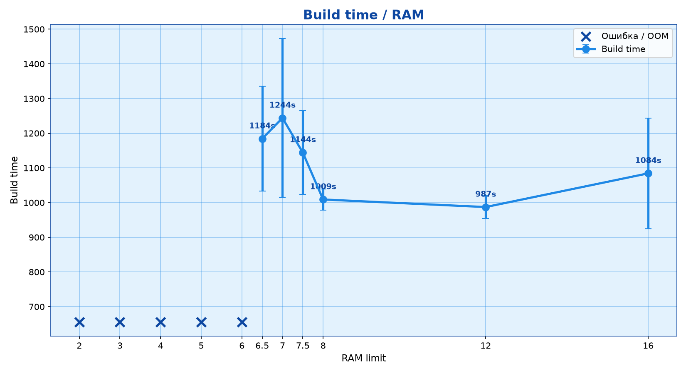
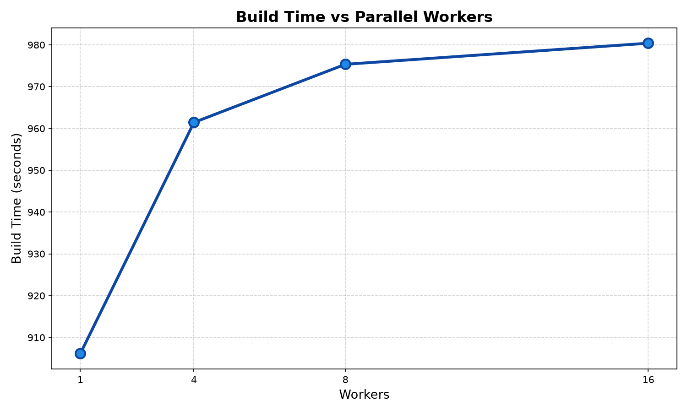
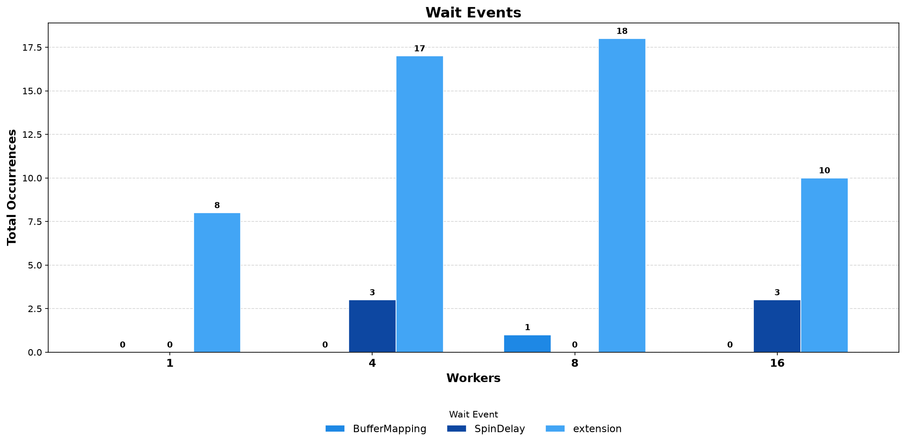
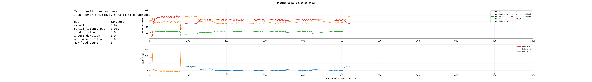
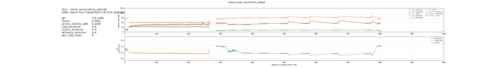
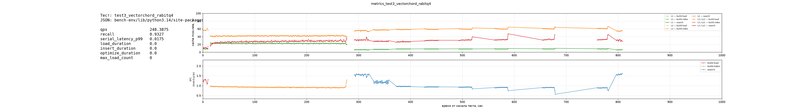
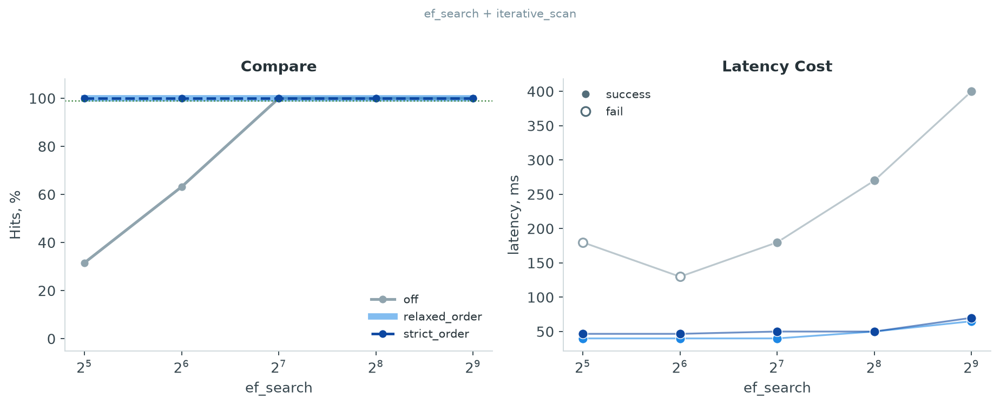

# Расширенное нагрузочное тестирование pgvector

  <strong>О документе:</strong> продолжение оригинального отчёта по масштабированию HNSW — четыре направления, каждое закрывает свой открытый вопрос.

## 1. Направления исследования

**1) Уровневый параллелизм при сборке** - 

**2) Рыночные расширения** - VectorChor (тестирование  RaBitQ) и pgvectorscale 

**3) RAM-порог через cgroups** - полная кривая деградации build time, что бы конкретезироаться необходимый запас ram 

**4) ef_search / recall при фильтрации** - разбор проблемы recall=0.012 на filter 99%, более 
подробноне тестирование разных сценариев и iterative_scan

## 2. Оборудование

**Уже известно:**

- ноутбук, **32 ГБ RAM**
- ОС: Linux
- Postgres18_STABLE
- 

## 5. Направление 2. RAM-порог через cgroups

**Цель:**

- Определить минимальный объём оперативной памяти, при котором сборка индекса HNSW на 500K векторах физически возможна.
- Построить полную кривую деградации build time при приближении к этому порогу — чтобы конкретно определить необходимый запас RAM и понять, как именно система деградирует при нехватке памяти.
- Получить формулу рекомендацию для будущих запусков.

**Измеряли:**

1) Время сборки индекса (Build time) при жёстком ограничении RAM через cgroups: 2, 3, 4, 5, 6, 6.5, 7, 7.5, 8, 12, 16 ГБ.
2) Факт падения сборки (Out of Memory) — отмечено крестами на графике.
3) Разброс времени сборки.

**Итог** — кривая чётко делится на три зоны:

1. **Зона OOM (≤ 6 ГБ)** — сборка невозможна. Индекс не помещается в отведённую память, cgroups убивают процесс.

2. **Зона пограничная (6.5 – 7.5 ГБ)** — сборка завершена, но с высоким временем (пик 1244s на 7 ГБ) и разбросом (±250–300s). Это похоже на работу с swap, поведение становится недетерминированным.

3. **Зона стабильности (≥ 8 ГБ)** — время сборки стабилизируется на уровне ~1000s.

**Вывод** — для 500K векторов (1536 dim) пороговое значение RAM составляет ~6.~5 ГБ и ниже этой отметки сборка падает, выше ~8 — резко стабилизируется. 

**Конкретная формула для планирования памяти:**

Для 500K векторов размерностью 1536:
- **Размер готового индекса:** ~3.5 ГБ
- **Минимум RAM для сборки:** 8 ГБ (коэффициент **2.3×** от размера индекса)
- **Рекомендуемый запас:** 12 ГБ (коэффициент **3.4×** от размера индекса)

**Рекомендация:** если индекс займет **X** ГБ памяти, то для его сборки нужно выделить:
- **Минимум:** 2.5 × X ГБ (все равно риск попадания в swap при пиковых нагрузках)
- **Рекомендуется:** 3.5 × X ГБ (стабильная сборка без деградации)

## 3. Направление. Параллелизм при сборке и аппаратные ограничения

**Цель:** 
- Оценить влияние увеличения числа параллельных воркеров на время построения индекса.

**Измеряли:**

1) Общее время сборки индекса (Build Time) при 1, 4, 8 и 16 воркерах.
2) События ожидания (Wait Events): `BufferMapping`, `SpinDelay`, `extension`.

**Итог** — вместо ожидаемого ускорения наблюдается обратный эффект: время сборки индекса растет с увеличением числа воркеров (с ~906 сек на 1 воркере до ~980 сек на 16). 

Анализ событий показывает, что при росте параллелизма возрастает количество событий extension и появляются события SpinDelay (в малом количестве). События `BufferMapping` остаются на нулевом уровне, что исключает классический contention буферного кэша Postgres.

**Вывод** — мы уперлись в аппаратное ограничение системы. Получилось, что узким местом является не алгоритм, а физические ресурсы . Добавление воркеров не ускоряет процесс, а лишь увеличивает накладные расходы на синхронизацию, переключение контекста и ожидание освобождения ресурсов.

**Рекомендация** — для текущей конфигурации оборудования и размера датасета использовать max_parallel_maintenance_workers = 1. Дальнейшее увеличение параллелизма при сборке индекса нецелесообразно и приводит к прямой деградации производительности. 

## 5. Направление 1. VectorChord RaBitQ

**Цель:**

- в оригинальном исследовании создание индекса убиралось в верхний потолок RAM, что делало не возмодным работу на больших датасетах
- Предполагаемая версия: сжатие индекса уменьшит его физический размер, снизит кэш-промахи на уровне L3/LLC и, как следствие, ускорит построение, поиск, сделаем возможным построение там где до этого граф не помещался.

**Измеряли:**

1) pgvector HNSW (baseline) — 50k, 500K векторов
2) VectorChord RabitQ8 — (сжатие в 4 раз) 50, 500K, 5M векторов
3) VectorChord RabitQ4 — (сжатие в 32 раза) 50, 500K векторов

На всех трёх конфигурациях снимались: cache miss-rate по уровням L1/L2/L3/LLC в разрезе фаз (build-load, build-index, search), IPC, QPS, recall.

Тесты на 50k 

Тесты на 500k 

**Итог** — кэш-мисы на уровне L3/LLC действительно снизились: с ~70–80% у baseline (pgvector HNSW) до ~60% у обоих вариантов VectorChord (RabitQ4 и RabitQ8). Это подтверждает исходное предположение о том, что уменьшенный индекс лучше помещается в кэш/память. Однако ожидаемого ускорения не произошло — наоборот, время построения индекса выросло примерно в 2 раза, а QPS поиска упал с 534 (baseline) до 231–248. Recall при RabitQ8 остался на уровне 0.99, при RabitQ4 просел до 0.93.

**Вывод** — применение сжатия имеет смысл только в тех случаях, когда данные физически не вмещаются в оперативную память и система начинает упираться в дисковый I/O или swap. В нашем сценарии датасет (500K векторов) и так полностью помещается в RAM, поэтому использование сжатия не даёт ускорения, а лишь добавляет процессору накладные расходы на распаковку и уточнение расстояний. 

Механизм работы RabitQ устроен так, что при первом сравнении используется сжатое представление вектора, но для уточнения расстояния алгоритм всё равно идёт в основную память за полными векторами. Это приводит к двойной работе.

**Рекомендация** в сценариях, когда объём векторов превышает доступную память, внешние инструменты сжатия нужны: уменьшение размера индекса позволяет вернуть весь рабочий набор обратно в быструю память и выполниться.

## 4. Направление 4. ef_search / recall при фильтрации

**Цель:**

- в оригинале на 5M: recall = 0.012 (фильтр 99%)
- Преполагаемая версия маленький ef_search 

**Измеряли:**

1) recall и QPS по ef_search 32–512 (фильтр 99%, индекс 500K)
2) отдельно: режимы iterative_scan

**Итог** - кривая recall под фильтром 99% не зависит от ef_search — рост ef_search с 32 до 512 не улучшает recall, если iterative_scan = off. При этом abсолютные значения низкие: в среднем возвращается ~0.4 строки из 100 запрошенных, что подтверждает исходную проблему (recall = 0.012) на новом наборе данных.

Отдельно проверено: при высокой селективности фильтра планировщик Postgres предпочитает Bitmap Heap Scan вместо HNSW Index Scan даже при enable_seqscan=off (стоимостная модель считает его дешевле). Без явного enable_bitmapscan=off измерения recall фактически относятся не к HNSW-индексу, а к bitmap-скану.

**Вывод** - изначальная рекомендация "повышать ef_search" была актуальна до появления iterative_scan (pgvector 0.8.0+) и не решает проблему в принципе: ef_search управляет шириной поиска до фильтрации, а не количеством кандидатов, прошедших фильтр. Механизм iterative_scan=relaxed_order устраняет саму причину — граф дообходится до тех пор, пока не наберётся max_scan_tuples кандидатов, удовлетворяющих фильтру, вместо одного прохода top-ef_search.

При дефолтном max_scan_tuples = 20000 recall восстанавливается с ~0.4/100 до 100/100. При заниженном (max_scan_tuples = 2000) recall восстанавливается лишь частично (24.7/100) — то есть параметр не универсален и должен калиброваться под ожидаемую селективность фильтра.

**Итоговая рекомендация** - 
1) Использовать iterative_scan = relaxed_order как основной механизм борьбы с recall-деградацией под фильтром, а не увеличение ef_search.
2) Max_scan_tuples калибровать под целевую селективность фильтра (дефолт 20000 достаточен для 99%, но не универсален для более жёстких фильтров) — требует отдельного теста на кривой selectivity → optimal max_scan_tuples.

Пометка - смотеть что используется HNSW Index Scan или  Bitmap Heap Scan перед тем как менять параметры.
